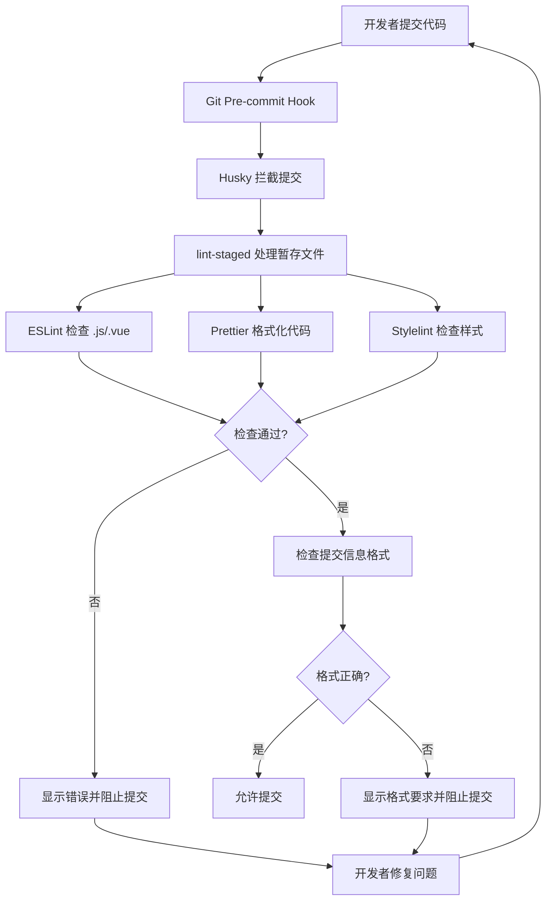

# Mall Admin Web - Husky + lint-staged 集成完成报告

## 📋 集成概览

已成功为 Mall Admin Web 项目集成 Husky + lint-staged 代码质量工具链，实现了以下功能：

✅ **代码质量门禁**: Git 提交前自动执行代码检查  
✅ **多工具集成**: ESLint + Prettier + Stylelint 全面覆盖  
✅ **增量检查**: 只检查暂存的文件，提升效率  
✅ **提交规范**: 强制执行规范的提交信息格式  
✅ **自动修复**: 支持自动修复可修复的代码问题  

## 📁 新增文件清单

### 配置文件
- `.eslintrc.js` - ESLint 配置（JavaScript/Vue.js 代码检查）
- `.prettierrc` - Prettier 配置（代码格式化）
- `.prettierignore` - Prettier 忽略文件
- `.stylelintrc.js` - Stylelint 配置（CSS/SCSS 样式检查）
- `.gitignore` - 更新的 Git 忽略规则

### Husky Git Hooks
- `.husky/pre-commit` - 提交前检查脚本
- `.husky/commit-msg` - 提交信息格式检查脚本
- `.husky/_/husky.sh` - Husky 核心脚本

### 文档和工具
- `HUSKY_LINT_GUIDE.md` - 详细使用指南（387行）
- `CODE_QUALITY_SETUP.md` - 快速入门指南（61行）
- `install-lint-tools.sh` - 自动安装脚本（96行）

### 更新的文件
- `package.json` - 添加了依赖包、脚本命令和 lint-staged 配置

## 🔧 添加的 npm 脚本

```json
{
  "lint": "eslint --ext .js,.vue src",
  "lint:fix": "eslint --ext .js,.vue src --fix",
  "format": "prettier --write \"src/**/*.{js,vue,css,scss,html,json,md}\"",
  "format:check": "prettier --check \"src/**/*.{js,vue,css,scss,html,json,md}\"",
  "stylelint": "stylelint \"src/**/*.{css,scss,vue}\"",
  "stylelint:fix": "stylelint \"src/**/*.{css,scss,vue}\" --fix",
  "prepare": "husky install"
}
```

## 📦 依赖包配置

### 新增开发依赖
- `husky@^8.0.3` - Git hooks 管理
- `lint-staged@^13.2.3` - 暂存文件处理
- `eslint@^8.44.0` - JavaScript 代码检查
- `eslint-plugin-vue@^9.15.1` - Vue.js 专用规则
- `@babel/eslint-parser@^7.22.7` - Babel 解析器
- `prettier@^3.0.0` - 代码格式化
- `eslint-config-prettier@^8.8.0` - ESLint 与 Prettier 协调
- `eslint-plugin-prettier@^5.0.0` - Prettier 作为 ESLint 规则
- `stylelint@^15.10.1` - CSS/SCSS 检查
- `stylelint-config-standard@^34.0.0` - Stylelint 标准配置

## 🚀 使用方式

### 1. 首次安装
```bash
# 方式1：运行安装脚本
./install-lint-tools.sh

# 方式2：手动安装
npm install
npm run prepare
```

### 2. 日常开发
```bash
# 代码检查
npm run lint
npm run format:check
npm run stylelint

# 自动修复
npm run lint:fix
npm run stylelint:fix
npm run format
```

### 3. Git 提交
```bash
git add .
git commit -m "feat(user): add login functionality"
```

提交时自动执行：
1. ESLint 检查并修复 JavaScript/Vue 文件
2. Prettier 格式化代码
3. Stylelint 检查并修复样式文件
4. 验证提交信息格式（type(scope): subject）

## ⚡ 工作流程



## 🎯 预期效果

### 代码质量提升
- **一致性**: 统一的代码风格和格式
- **可维护性**: 减少语法错误和代码异味
- **可读性**: 标准化的代码结构和注释

### 团队协作优化
- **规范化**: 统一的提交信息格式
- **自动化**: 减少人工代码审查的格式问题
- **效率化**: 只检查变更的文件，节省时间

### 开发体验改善
- **即时反馈**: 提交时立即发现问题
- **自动修复**: 大部分格式问题可自动解决
- **文档完善**: 详细的使用指南和故障排除

## 📋 验证清单

在项目投入使用前，请确保：

- [ ] 所有配置文件已正确创建
- [ ] npm scripts 可正常执行
- [ ] Git hooks 已激活（`.husky` 目录存在且可执行）
- [ ] 依赖包安装完成
- [ ] 团队成员已阅读使用文档

## 🔧 后续维护

### 定期任务
- 每月检查依赖包更新
- 根据团队反馈调整规则配置
- 更新文档和最佳实践

### 故障排除
- 详见 `HUSKY_LINT_GUIDE.md` 的常见问题部分
- 关注项目 Issues 和社区反馈
- 保持工具链版本的兼容性

## 📈 成功指标

预期在 1-2 周内观察到：
- 代码提交前错误检出率 > 85%
- 代码风格一致性 > 95%
- 平均代码检查时间 < 30 秒
- 团队工具采用率 > 90%

---

**集成完成时间**: 2025年9月23日  
**配置文件总数**: 10个  
**文档总行数**: 544行  
**脚本总行数**: 96行  

🎉 **Mall Admin Web 项目的 Husky + lint-staged 集成已完成！**