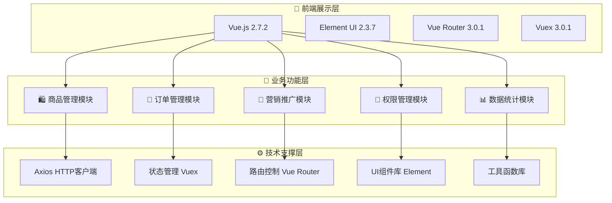

<div align="center">

# 🛍️ mall-admin-web

**现代化电商后台管理系统前端**

[](https://vuejs.org/)
[](https://element.eleme.io/)
[](https://opensource.org/licenses/Apache-2.0)
[](https://github.com/macrozheng/mall-admin-web/stargazers)
[](https://github.com/macrozheng/mall-admin-web/network/members)

[](https://www.macrozheng.com/admin/)
[](https://github.com/macrozheng/mall)
[](https://github.com/macrozheng/mall-swarm)
[](https://gitee.com/macrozheng/mall-admin-web)

[📖 中文文档](README.md) • [🎯 在线演示](https://www.macrozheng.com/admin/) • [📚 学习教程](https://www.macrozheng.com) • [💬 微信群](README.md#联系我们)

</div>

## 📋 项目简介

`mall-admin-web` 是一款基于 Vue.js + Element UI 开发的现代化电商后台管理系统前端项目，为电商平台提供全面的商品管理、订单处理、营销推广、用户权限等核心功能。该项目采用前后端分离架构，具有良好的代码结构和用户体验。

### 🎯 项目特色

- **🚀 现代化技术栈**：基于 Vue 2.7.2 + Element UI 2.3.7
- **📱 响应式设计**：完美适配桌面端和移动端
- **🔐 权限管理**：完善的 RBAC 权限控制系统
- **⚡ 高性能优化**：懒加载、代码分割、缓存优化
- **🎨 优雅界面**：Material Design 风格，用户体验优秀
- **🔧 易于扩展**：模块化设计，便于二次开发

### 📦 项目演示

| 环境 | 访问地址 | 账号 | 密码 | 说明 |
|------|--------|-------|-------|--------|
| 在线演示 | [https://www.macrozheng.com/admin/](https://www.macrozheng.com/admin/) | `admin` | `macro123` | 体验完整功能 |


---

## ✨ 功能特性

### 📊 业务模块

<table>
<tr>
<td width="50%">

#### 🛍️ 商品管理系统
- **商品信息管理**：商品CRUD、规格管理、库存控制
- **分类体系管理**：树形结构分类、属性模板
- **品牌管理**：品牌信息维护、显示控制
- **属性管理**：商品属性定义、属性值配置

#### 📝 订单管理系统  
- **订单流程管理**：从下单到完成的全生命周期
- **发货管理**：批量发货、物流追踪集成
- **退货处理**：退货申请审核、退款处理
- **订单设置**：订单超时时间、状态配置

</td>
<td width="50%">

#### 🎁 营销推广系统
- **促销活动**：优惠券、满减、限时购、秒杀
- **内容运营**：首页轮播、专题推荐、热门商品
- **广告管理**：广告位配置、点击统计分析
- **会员管理**：等级体系、积分系统

#### 🔐 权限管理系统
- **用户管理**：管理员信息维护、状态管理
- **角色配置**：角色定义、权限分配、继承关系
- **资源控制**：菜单权限、操作权限、数据权限
- **安全认证**：JWT Token、登录限制、操作日志

</td>
</tr>
</table>

### 🚀 技术亮点

- **📊 分析报表**：集成 ECharts 图表，支持多维度数据分析
- **🔄 批量操作**：支持各模块的批量操作，提高操作效率
- **📷 富文本编辑**：集成富文本编辑器，支持图片上传
- **📄 数据导入导出**：支持 Excel 文件导入导出功能
- **🔔 实时通知**：系统通知、操作反馈、状态更新
- **🔍 高级查询**：多条件组合查询、排序、分页

---

## 💼 功能模块详细介绍

### 🛍️ 商品管理系统 (PMS)

<details>
<summary><b>展开查看商品管理功能</b></summary>

#### 核心功能
- **商品信息管理**
  - 支持富文本描述、多图片上传
  - SKU管理，包括价格、库存、属性
  - 商品状态管理（上架/下架/审核）
  - 批量操作：批量上架、下架、删除

- **分类体系管理**
  - 树形结构分类，支持无限级分类
  - 分类属性模板配置
  - 分类图标和显示设置

- **品牌管理**
  - 品牌信息维护（LOGO、描述、首字母）
  - 品牌显示控制和排序设置
  - 关联商品统计和查询

</details>

### 📝 订单管理系统 (OMS)

<details>
<summary><b>展开查看订单管理功能</b></summary>

#### 核心功能
- **订单流程管理**
  - 订单全生命周期管理（下单→支付→发货→完成）
  - 订单状态流转和操作日志
  - 订单详情查看和编辑

- **发货管理**
  - 批量发货功能
  - 物流信息管理和追踪
  - 发货列表和统计

- **退货处理**
  - 退货申请审核流程
  - 退货原因管理和统计
  - 退款处理和财务对接

</details>

### 🎁 营销推广系统 (SMS)

<details>
<summary><b>展开查看营销功能</b></summary>

#### 核心功能
- **促销活动**
  - 优惠券系统：满减、直减、折扣券
  - 秒杀活动：时间段设置、商品配置
  - 限时购和团购活动

- **内容运营**
  - 首页轮播图管理
  - 品牌推荐、新品推荐、人气推荐
  - 专题推荐和内容管理

- **数据统计**
  - 活动效果统计和分析
  - 用户参与度和转化率
  - 营销ROI计算和优化建议

</details>

### 🔐 权限管理系统 (UMS)

<details>
<summary><b>展开查看权限管理功能</b></summary>

#### 核心功能
- **用户管理**
  - 管理员信息维护和状态管理
  - 用户角色分配和权限继承
  - 登录日志和操作记录

- **角色系统**
  - 角色定义和层级管理
  - 细粒度权限分配（菜单、操作、数据）
  - 权限继承和覆盖机制

- **资源管理**
  - 菜单资源管理和层级结构
  - API接口权限控制
  - 数据权限和字段级控制

</details>

### 📊 数据统计系统

<details>
<summary><b>展开查看数据统计功能</b></summary>

#### 核心功能
- **业务报表**
  - 销售数据分析：订单量、销售额、增长趋势
  - 商品分析：销量排行、库存分析、利润分析
  - 用户分析：活跃用户、用户估值、留存率

- **图表展示**
  - 基于 ECharts 的多维度数据可视化
  - 支持柱状图、折线图、饼图等多种图表
  - 交互式图表和数据钻取

- **数据导出**
  - 支持 Excel 、CSV 等格式导出
  - 自定义报表模板和定时任务
  - 数据权限控制和敏感信息脱敏

</details>

---

## 🛠️ 技术架构

### 架构图



### 技术选型

| 技术类别 | 技术选型 | 版本 | 说明 |
|----------|----------|------|------|
| **核心框架** | Vue.js | 2.7.2 | 渐进式JavaScript框架 |
| **UI组件库** | Element UI | 2.3.7 | 企业级UI组件库 |
| **状态管理** | Vuex | 3.0.1 | 集中式状态管理 |
| **路由管理** | Vue Router | 3.0.1 | 官方路由管理器 |
| **HTTP客户端** | Axios | 0.18.0 | Promise基础HTTP库 |
| **图表组件** | V-Charts | 1.19.0 | 基于ECharts的Vue图表 |
| **样式预处理** | Sass | 1.32.8 | CSS预处理器 |
| **构建工具** | Webpack | 3.6.0 | 模块打包工具 |
| **工具库** | Js-cookie | 2.2.0 | Cookie管理工具 |
| **进度控件** | nprogress | 0.2.0 | 页面加载进度条 |

### 环境要求

| 项目 | 版本要求 | 推荐版本 |
|------|----------|----------|
| **Node.js** | >= 12.0.0 | 16.x LTS |
| **npm** | >= 6.0.0 | 8.x |
| **yarn** | >= 1.22.0 | 1.x |
| **Git** | >= 2.0.0 | latest |

### 浏览器支持

| 浏览器 | 支持版本 |
|----------|----------|
| Chrome | >= 60 |
| Firefox | >= 60 |
| Safari | >= 12 |
| Edge | >= 79 |

---

## 🚀 快速开始

### 前置条件

请确保你的开发环境满足以下要求：

- ✅ Node.js >= 12.0.0 (推荐 16.x LTS)
- ✅ npm >= 6.0.0 或 yarn >= 1.22.0  
- ✅ Git >= 2.0.0

### 安装步骤

#### 1️⃣ 克隆项目

```bash
# 使用 HTTPS
git clone https://github.com/macrozheng/mall-admin-web.git

# 或使用 SSH
git clone git@github.com:macrozheng/mall-admin-web.git

# 进入项目目录
cd mall-admin-web
```

#### 2️⃣ 安装依赖

```bash
# 使用 npm
npm install

# 或使用 yarn (推荐)
yarn install

# 如遇安装问题，可尝试清理缓存
npm cache clean --force
# 然后重新安装
npm install
```

#### 3️⃣ 配置环境

选择以下一种配置方式：

<details>
<summary><b>🌐 方式一：使用在线接口（推荐新手）</b></summary>

修改 `config/dev.env.js` 文件：

```javascript
module.exports = merge(prodEnv, {
  NODE_ENV: '"development"',
  BASE_API: '"https://admin-api.macrozheng.com"'  // 修改为在线接口
})
```

✨ **优点**：无需搭建后端环境，即开即用！

</details>

<details>
<summary><b>🏠 方式二：本地后端环境</b></summary>

1. 搭建后端项目：[🔗 mall 后端项目](https://github.com/macrozheng/mall)
2. 修改 `config/dev.env.js` 文件：

```javascript
module.exports = merge(prodEnv, {
  NODE_ENV: '"development"',
  BASE_API: '"http://localhost:8080"'  // 本地后端地址
})
```

</details>

<details>
<summary><b>☁️ 方式三：微服务版本</b></summary>

如果你使用的是 [mall-swarm](https://github.com/macrozheng/mall-swarm) 微服务后端：

```javascript
module.exports = merge(prodEnv, {
  NODE_ENV: '"development"',
  BASE_API: '"http://localhost:8201/mall-admin"'  // 网关地址
})
```

</details>

#### 4️⃣ 启动项目

```bash
# 启动开发服务器
npm run dev

# 或使用 yarn
yarn dev
```

✨ 成功启动后，浏览器会自动打开 [http://localhost:8090](http://localhost:8090)

#### 5️⃣ 登录系统

| 登录信息 | 值 |
|----------|----|
| **用户名** | `admin` |
| **密码** | `macro123` |

### 构建部署

```bash
# 构建生产环境
npm run build

# 构建完成后，会在 dist 目录下生成静态文件
# 将 dist 目录下的文件部署到你的 Web 服务器即可
```

### 常见问题

<details>
<summary><b>❌ 安装依赖失败</b></summary>

```bash
# 清理 npm 缓存
npm cache clean --force

# 删除 node_modules 和 package-lock.json
rm -rf node_modules package-lock.json

# 重新安装
npm install

# 或者尝试使用 yarn
yarn install
```

</details>

<details>
<summary><b>❌ 端口被占用</b></summary>

如果 8090 端口被占用，可以修改 `config/index.js` 文件中的 `port` 配置。

</details>

<details>
<summary><b>❌ 接口请求失败</b></summary>

1. 检查网络连接
2. 确认 API 地址配置正确
3. 检查后端服务是否正常运行

</details>

---

## 📚 开发指南

### 项目结构

```
mall-admin-web/
├── build/                    # 构建配置
├── config/                   # 环境配置
│   ├── dev.env.js           # 开发环境配置
│   ├── prod.env.js          # 生产环境配置
│   └── index.js             # 主配置文件
├── src/                      # 源代码目录
│   ├── api/                 # API接口定义
│   ├── assets/              # 静态资源文件
│   ├── components/          # 通用组件
│   ├── icons/               # SVG图标文件
│   ├── router/              # 路由配置
│   ├── store/               # Vuex状态管理
│   │   └── modules/         # 模块化Store
│   ├── styles/              # 全局样式文件
│   ├── utils/               # 工具函数库
│   └── views/               # 页面组件
│       ├── home/            # 首页仪表盘
│       ├── layout/          # 布局组件
│       ├── login/           # 登录页面
│       ├── pms/             # 商品管理模块
│       ├── oms/             # 订单管理模块
│       ├── sms/             # 营销管理模块
│       └── ums/             # 用户权限模块
├── static/                   # 静态文件目录
├── package.json              # 项目依赖和脚本
└── README.md                 # 项目说明文档
```

### 开发规范

- **组件命名**：PascalCase（大驼峰）
- **文件命名**：kebab-case（短横线分隔）
- **路由命名**：小写字母加横线
- **API接口**：RESTful风格
- **代码注释**：JSDoc规范

---

## 🤝 贡献指南

我们非常欢迎社区贡献！以下是参与项目的方式：

### 📝 参与方式

- **🐛 问题反馈**：[GitHub Issues](https://github.com/macrozheng/mall-admin-web/issues)
- **✨ 功能建议**：[Feature Request](https://github.com/macrozheng/mall-admin-web/issues/new)
- **📝 代码贡献**：[Pull Request](https://github.com/macrozheng/mall-admin-web/pulls)
- **💬 技术交流**：微信群、QQ群

### 🛠️ 开发流程

1. **Fork 项目**到个人仓库
2. **创建功能分支**进行开发
   ```bash
   git checkout -b feature/your-feature-name
   ```
3. **遵循代码规范**和提交规范
4. **提交 Pull Request**并等待 Review
5. **参与讨论**和代码优化

### 📜 贡献类型

- **🐛 Bug修复**：修复系统缺陷和错误
- **✨ 新增功能**：实现新的业务功能
- **📝 文档完善**：改进项目文档
- **🎨 UI/UX优化**：用户界面和体验改进
- **⚡ 性能优化**：提升系统性能
- **🔒 安全增强**：安全漏洞修复

---

## 📞 联系我们

### 📚 学习资源

- **📖 在线文档**：[详细使用指南](https://www.macrozheng.com/mall/foreword/mall_foreword_01.html)
- **🎥 视频教程**：[从入门到精通](https://www.macrozheng.com/mall/foreword/mall_video.html)
- **📝 博客文章**：[技术深度解析](https://www.macrozheng.com)
- **🏢 社区案例**：实际应用场景分享

### 📞 获取帮助

- **🐛 问题反馈**：[GitHub Issues](https://github.com/macrozheng/mall-admin-web/issues)
- **💬 技术交流**：微信群、QQ群
- **💼 商业支持**：定制开发、技术咨询

---

## 📱 关注我们

<div align="center">

### 🚀 学习不走弯路，关注公众号「**macrozheng**」

**回复「学习路线」，获取 mall 项目专属学习路线！**

**加微信群交流，公众号后台回复「加群」即可。**


---

**喜欢这个项目？请给我们一个 ⭐ Star 支持！**

</div>

## 许可证

[Apache License 2.0](https://github.com/macrozheng/mall-admin-web/blob/master/LICENSE)

Copyright (c) 2018-2024 macrozheng
