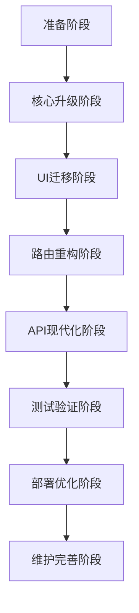

# Mall-Admin-Web Vue 3 升级分阶段实施计划

## 项目背景

Mall-Admin-Web是一个基于Vue 2.7.2的电商管理后台系统，需要升级到Vue 3以获得更好的性能、TypeScript支持和长期维护保障。本文档制定了详细的分阶段升级计划。

## 整体升级策略

### 升级原则
1. **渐进式升级** - 分阶段逐步升级，降低风险
2. **功能优先** - 确保业务功能不受影响
3. **性能提升** - 利用Vue 3的性能优势
4. **团队适应** - 给团队充足的学习适应时间

### 升级路径图



## 阶段一：环境准备与分析 (2天)

### 目标
- 完成项目现状全面分析
- 准备升级所需的开发环境
- 建立安全的升级流程

### 详细任务

#### Day 1: 项目分析和环境准备
**上午 (4小时)**
- [x] 分析现有项目结构和依赖关系
- [x] 评估25个Vue组件的复杂度
- [x] 识别关键业务流程和风险点
- [ ] 创建项目备份和版本控制策略

**下午 (4小时)**
- [ ] 搭建Vue 3开发环境
- [ ] 升级Node.js到16.x+版本
- [ ] 安装Vue 3开发工具和插件
- [ ] 配置ESLint和Prettier支持Vue 3

#### Day 2: 兼容性分析和计划制定
**上午 (4小时)**
- [ ] 分析所有npm依赖的Vue 3兼容性
- [ ] 识别需要替换的不兼容包
- [ ] 制定详细的依赖升级清单
- [ ] 评估第三方库的迁移成本

**下午 (4小时)**
- [ ] 制定详细的测试策略
- [ ] 建立回滚方案和应急预案
- [ ] 准备升级过程的监控指标
- [ ] 团队培训计划制定

### 交付物
- ✅ 项目现状分析报告
- ⏳ 依赖兼容性评估报告
- ⏳ 详细的升级时间线
- ⏳ 风险评估和缓解方案

### 验收标准
- [ ] 所有依赖包兼容性明确
- [ ] 开发环境配置完成
- [ ] 备份和回滚方案验证通过
- [ ] 团队成员了解升级计划

---

## 阶段二：Vue核心框架升级 (5天)

### 目标
- 升级Vue核心框架到3.4+
- 升级构建工具和编译配置
- 确保应用基础功能正常运行

### 详细任务

#### Day 3: Vue核心包升级
**上午 (4小时)**
- [ ] 升级Vue从2.7.2到3.4+
- [ ] 更新vue-template-compiler到@vue/compiler-sfc
- [ ] 升级vue-loader到16.x+
- [ ] 配置新的Vue编译选项

**下午 (4小时)**
- [ ] 修改main.js入口文件
  ```javascript
  // 从 new Vue() 改为 createApp()
  import { createApp } from 'vue'
  import App from './App.vue'
  createApp(App).mount('#app')
  ```
- [ ] 更新全局配置方式
- [ ] 测试应用基础启动功能

#### Day 4-5: 构建系统升级
**Day 4 上午**
- [ ] 升级webpack从3.6.0到5.x
- [ ] 更新babel配置支持Vue 3
- [ ] 配置新的开发服务器
- [ ] 解决构建警告和错误

**Day 4 下午**
- [ ] 更新生产构建配置
- [ ] 配置代码分割策略
- [ ] 优化打包性能设置
- [ ] 测试构建产物正确性

**Day 5 全天**
- [ ] Vite迁移评估 (可选)
- [ ] 开发服务器性能优化
- [ ] 热更新功能验证
- [ ] 构建缓存策略配置

#### Day 6-7: 基础功能验证
**Day 6**
- [ ] 验证应用启动流程
- [ ] 检查基础路由功能
- [ ] 测试开发和生产环境
- [ ] 解决兼容性问题

**Day 7**
- [ ] 性能基准测试
- [ ] 内存使用情况监控
- [ ] 错误日志收集配置
- [ ] 阶段性功能验收

### 交付物
- ⏳ 可运行的Vue 3基础版本
- ⏳ 更新的构建配置
- ⏳ 基础功能测试报告
- ⏳ 性能对比数据

### 验收标准
- [ ] 应用可以正常启动
- [ ] 开发环境热更新正常
- [ ] 生产构建无错误
- [ ] 基础路由导航正常

---

## 阶段三：状态管理和路由升级 (5天)

### 目标
- 升级Vue Router到4.x
- 升级Vuex到4.x或迁移到Pinia
- 确保状态管理和路由功能正常

### 详细任务

#### Day 8-9: Vue Router升级
**Day 8 上午**
- [ ] 升级vue-router从3.0.1到4.x
- [ ] 更新路由创建方式
  ```javascript
  // 从 new Router() 改为 createRouter()
  import { createRouter, createWebHistory } from 'vue-router'
  export default createRouter({
    history: createWebHistory(),
    routes: constantRouterMap
  })
  ```

**Day 8 下午**
- [ ] 更新路由配置参数
- [ ] 检查动态路由兼容性
- [ ] 验证路由守卫功能
- [ ] 测试权限控制逻辑

**Day 9**
- [ ] 更新路由导航方法
- [ ] 检查编程式导航
- [ ] 验证路由元信息(meta)
- [ ] 测试所有页面路由

#### Day 10-11: 状态管理升级
**Day 10 上午**
- [ ] 评估Vuex 4.x vs Pinia
- [ ] 选择状态管理方案
- [ ] 升级现有store配置
- [ ] 更新状态管理语法

**Day 10 下午**
- [ ] 重构store模块结构
- [ ] 更新getters使用方式
- [ ] 验证mutations和actions
- [ ] 测试状态持久化

**Day 11**
- [ ] 组件中状态使用更新
- [ ] mapState, mapGetters等辅助函数更新
- [ ] 状态管理类型定义 (如使用TypeScript)
- [ ] 状态管理功能全面测试

#### Day 12: 权限系统验证
- [ ] 用户登录状态管理
- [ ] 路由权限控制
- [ ] 菜单权限显示
- [ ] API权限拦截
- [ ] 权限系统完整测试

### 交付物
- ⏳ 升级后的路由系统
- ⏳ 现代化的状态管理
- ⏳ 权限控制验证报告
- ⏳ 状态管理性能报告

### 验收标准
- [ ] 所有路由正常跳转
- [ ] 用户状态管理正常
- [ ] 权限控制功能正常
- [ ] 无状态管理相关错误

---

## 阶段四：UI组件库迁移 (10天)

### 目标
- 将Element UI 2.3.7迁移到Element Plus
- 更新所有组件API调用
- 确保UI交互和样式正常

### 详细任务

#### Day 13-14: Element Plus安装配置
**Day 13**
- [ ] 卸载Element UI依赖
- [ ] 安装Element Plus 2.x
- [ ] 配置全局引入方式
- [ ] 设置主题变量

**Day 14**
- [ ] 配置按需引入 (可选)
- [ ] 更新图标引入方式
- [ ] 配置国际化设置
- [ ] 基础组件显示验证

#### Day 15-18: 核心组件迁移
**Day 15: 公共组件**
- [ ] `Breadcrumb/index.vue` - 面包屑组件
- [ ] `Hamburger/index.vue` - 汉堡菜单
- [ ] `SvgIcon/index.vue` - SVG图标组件
- [ ] 验证组件显示和交互

**Day 16: 布局组件**
- [ ] `Layout.vue` - 主布局组件
- [ ] `AppMain.vue` - 主内容区
- [ ] `Navbar.vue` - 导航栏
- [ ] `Sidebar/` - 侧边栏组件

**Day 17: 表单和输入组件**
- [ ] `login/index.vue` - 登录表单
- [ ] `Upload/` - 文件上传组件
- [ ] 各种表单组件API更新
- [ ] 表单验证逻辑检查

**Day 18: 富文本和特殊组件**
- [ ] `Tinymce/` - 富文本编辑器
- [ ] `ScrollBar/index.vue` - 滚动条组件
- [ ] 第三方组件兼容性检查

#### Day 19-22: 业务页面迁移
**Day 19: 商品管理模块 (PMS)**
- [ ] 商品列表页面组件更新
- [ ] 商品添加/编辑表单
- [ ] 商品分类管理界面
- [ ] 品牌管理页面

**Day 20: 订单管理模块 (OMS)**
- [ ] 订单列表和搜索
- [ ] 订单详情页面
- [ ] 退货申请处理
- [ ] 物流管理界面

**Day 21: 营销管理模块 (SMS)**
- [ ] 优惠券管理界面
- [ ] 秒杀活动配置
- [ ] 广告管理页面
- [ ] 推荐位管理

**Day 22: 权限管理模块 (UMS)**
- [ ] 用户管理界面
- [ ] 角色权限配置
- [ ] 菜单管理页面
- [ ] 资源权限设置

### 交付物
- ⏳ 完整迁移的UI组件
- ⏳ 组件API变更文档
- ⏳ UI一致性验证报告
- ⏳ 浏览器兼容性测试

### 验收标准
- [ ] 所有页面UI显示正常
- [ ] 用户交互功能正常
- [ ] 响应式布局正常
- [ ] 无UI相关的控制台错误

---

## 阶段五：Composition API重构 (选择性) (7天)

### 目标
- 重构关键组件使用Composition API
- 提取可复用的业务逻辑
- 提升代码可维护性

### 详细任务

#### Day 23-24: 核心组件重构
**Day 23: 登录组件重构**
- [ ] 将登录表单逻辑转换为Composition API
- [ ] 提取表单验证逻辑
- [ ] 重构用户认证流程
- [ ] 性能和功能验证

**Day 24: 导航和布局组件**
- [ ] Navbar组件Composition API重构
- [ ] Sidebar组件逻辑优化
- [ ] 布局响应式逻辑提取

#### Day 25-26: Composables抽取
**Day 25**
- [ ] `useAuth` - 身份验证相关逻辑
- [ ] `usePermission` - 权限检查逻辑
- [ ] `useRequest` - HTTP请求封装

**Day 26**
- [ ] `useTable` - 表格数据管理
- [ ] `useForm` - 通用表单逻辑
- [ ] `usePagination` - 分页逻辑

#### Day 27-29: 业务组件重构
**Day 27: 数据管理组件**
- [ ] 商品列表组件重构
- [ ] 订单管理组件重构
- [ ] 数据加载和状态管理优化

**Day 28: 表单组件重构**
- [ ] 商品添加/编辑表单
- [ ] 用户信息表单
- [ ] 通用表单组件抽取

**Day 29: 性能优化**
- [ ] 组件渲染性能优化
- [ ] 内存使用优化
- [ ] 代码分割和懒加载

### 交付物
- ⏳ 重构后的核心组件
- ⏳ 可复用的Composables
- ⏳ 性能提升报告
- ⏳ 代码质量评估

### 验收标准
- [ ] 组件功能保持一致
- [ ] 代码可读性提升
- [ ] 逻辑复用性增强
- [ ] 性能指标改善

---

## 阶段六：API和工具升级 (3天)

### 目标
- 升级HTTP客户端和API层
- 更新工具函数和辅助库
- 现代化项目工具链

### 详细任务

#### Day 30: HTTP客户端升级
- [ ] 升级axios到最新版本
- [ ] 更新请求拦截器配置
- [ ] 优化响应拦截器逻辑
- [ ] 更新错误处理机制

#### Day 31: 工具函数现代化
- [ ] 更新utils工具函数
- [ ] 优化日期处理函数
- [ ] 更新验证函数
- [ ] 添加TypeScript类型 (可选)

#### Day 32: 开发工具优化
- [ ] 更新ESLint配置
- [ ] 配置Prettier格式化
- [ ] 优化Vue DevTools配置
- [ ] 更新编辑器插件配置

### 交付物
- ⏳ 现代化的API层
- ⏳ 优化的工具函数
- ⏳ 完善的开发工具配置

---

## 阶段七：全面测试验证 (7天)

### 目标
- 全面测试所有功能模块
- 性能和兼容性验证
- 用户体验评估

### 详细任务

#### Day 33-34: 功能测试
**Day 33: 核心功能测试**
- [ ] 用户登录/登出流程
- [ ] 权限控制验证
- [ ] 菜单导航测试
- [ ] 数据CRUD操作

**Day 34: 业务流程测试**
- [ ] 商品管理完整流程
- [ ] 订单处理流程
- [ ] 营销活动配置
- [ ] 用户权限分配

#### Day 35-36: 性能和兼容性测试
**Day 35: 性能测试**
- [ ] 首屏加载时间测量
- [ ] 路由切换性能测试
- [ ] 内存使用情况监控
- [ ] 大数据量处理测试

**Day 36: 兼容性测试**
- [ ] Chrome 90+ 测试
- [ ] Firefox 88+ 测试
- [ ] Safari 14+ 测试
- [ ] Edge 90+ 测试

#### Day 37-39: 用户验收测试
**Day 37: UI/UX验证**
- [ ] 界面一致性检查
- [ ] 用户交互体验
- [ ] 响应式设计验证
- [ ] 无障碍性检查

**Day 38: 错误处理测试**
- [ ] 网络错误处理
- [ ] 数据异常处理
- [ ] 权限异常处理
- [ ] 系统容错能力

**Day 39: 压力测试**
- [ ] 并发用户测试
- [ ] 大数据量加载
- [ ] 长时间运行稳定性
- [ ] 内存泄漏检查

### 交付物
- ⏳ 全面的功能测试报告
- ⏳ 性能基准测试结果
- ⏳ 兼容性测试报告
- ⏳ 用户验收测试报告

---

## 阶段八：生产部署 (3天)

### 目标
- 准备生产环境部署
- 配置监控和日志
- 执行安全的发布流程

### 详细任务

#### Day 40: 部署准备
- [ ] 生产环境构建优化
- [ ] 环境变量配置
- [ ] 静态资源CDN配置
- [ ] 服务器配置检查

#### Day 41: 发布执行
- [ ] 灰度发布策略
- [ ] 数据库迁移 (如需要)
- [ ] 服务切换和验证
- [ ] 回滚方案准备

#### Day 42: 监控配置
- [ ] 错误监控系统配置
- [ ] 性能监控设置
- [ ] 用户行为分析
- [ ] 告警机制配置

### 交付物
- ⏳ 生产环境部署
- ⏳ 监控和日志系统
- ⏳ 部署文档和流程

---

## 阶段九：优化和维护 (持续)

### 目标
- 持续优化和改进
- 团队培训和知识转移
- 建立长期维护机制

### 持续任务
- [ ] 性能监控和优化
- [ ] 依赖包安全更新
- [ ] 用户反馈收集和处理
- [ ] 团队技能提升计划

## 风险管控

### 关键风险点
1. **第三方依赖不兼容** - 提前验证，准备替代方案
2. **业务功能回归** - 完善的测试覆盖
3. **性能降级** - 持续的性能监控
4. **团队适应成本** - 充分的培训和文档

### 应急预案
- 每个阶段都有明确的回滚点
- 关键功能的备用实现方案
- 24小时内快速回滚能力
- 专项技术支持团队

## 成功指标

### 技术指标
- [ ] 首屏加载时间 < 3秒
- [ ] 内存使用量降低20%
- [ ] 打包体积减少15%
- [ ] 开发构建速度提升50%

### 业务指标  
- [ ] 用户操作流程零中断
- [ ] 功能完整性100%
- [ ] 用户体验一致性
- [ ] 系统稳定性99.9%+

### 团队指标
- [ ] 100%团队成员完成Vue 3培训
- [ ] 开发效率提升30%
- [ ] Bug修复时间减少40%
- [ ] 代码维护成本降低25%

---

*本分阶段计划基于设计文档和项目现状制定，实际执行过程中可根据具体情况灵活调整时间安排和任务优先级。*